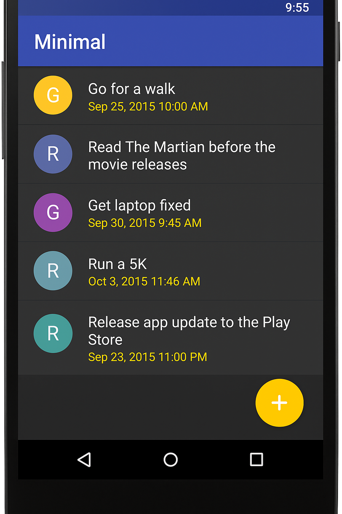
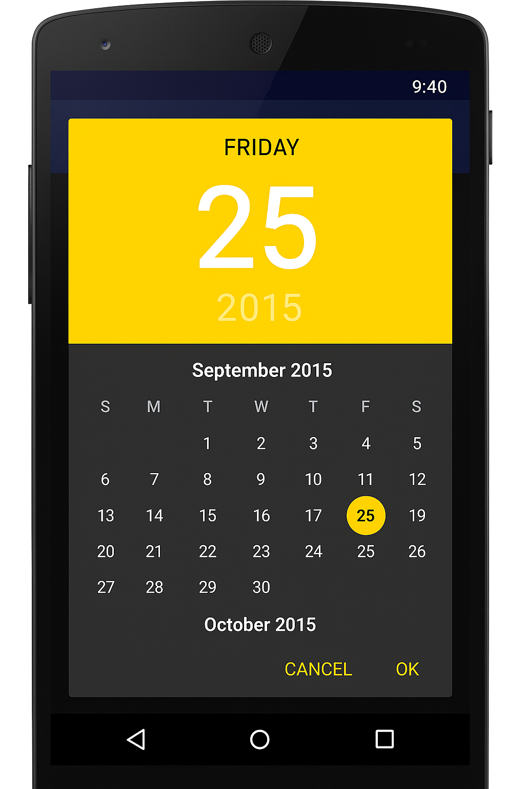
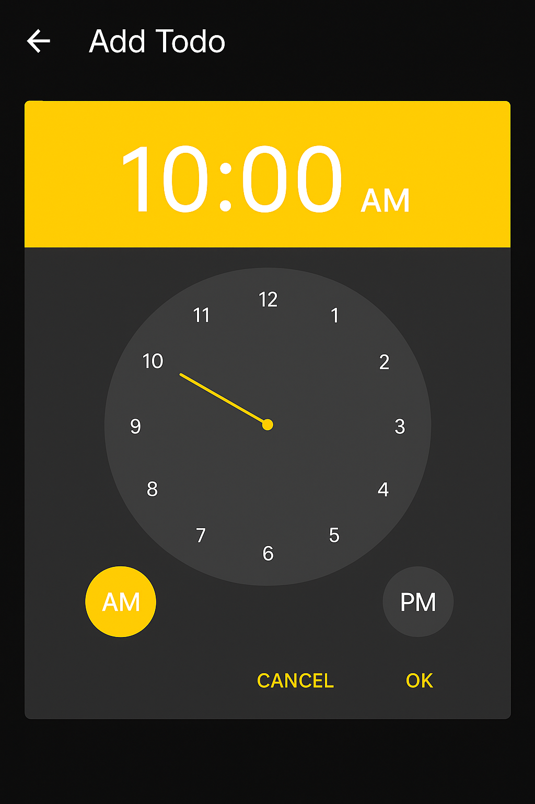

A simple and elegant ToDo application built with Flutter, designed to help you manage your tasks efficiently. This app allows you to add, edit, and delete tasks with ease.

# Features
Add ToDo: Use the floating action button at the bottom right to add a new ToDo item.
Edit ToDo: Tap on the three-dot menu on each ToDo item to edit it.
Delete ToDo: Tap on the three-dot menu on each ToDo item to delete it.
ToDo List: View all your ToDo items in a list format.

# Screenshots

  
  
  
  
  
  

# Installation
To clone and run this application, you'll need Git, and Flutter installed on your computer. From your command line:

bash
Copy code
# Clone this repository
$ git clone https://github.com/yourusername/todo-app.git

# Go into the repository
$ cd todo-app

# Install dependencies
$ flutter pub get

# Run the app
$ flutter run

# Usage
Adding a ToDo:
Tap on the Add ToDo button at the bottom right corner.
Enter your ToDo details and save.

Editing a ToDo:

Tap on the three-dot menu of the ToDo item you want to edit.
Select edit and modify your ToDo details.

Deleting a ToDo:

Tap on the three-dot menu of the ToDo item you want to delete.
Select delete to remove the ToDo item.

Contributing
Fork it!
Create your feature branch: git checkout -b my-new-feature
Commit your changes: git commit -am 'Add some feature'
Push to the branch: git push origin my-new-feature
Submit a pull request
License
This project is licensed under the MIT License - see the LICENSE.md file for details.

Acknowledgements
Flutter
GitHub
